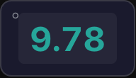
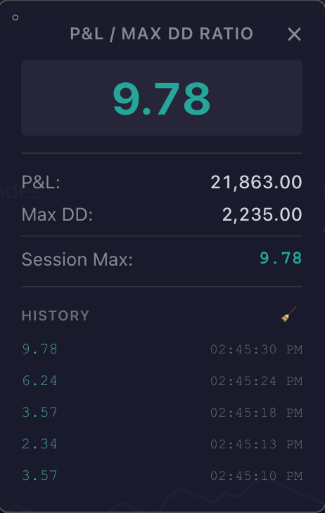

# TradingView P&L / Drawdown Ratio Extension

A Chrome extension that displays the **Total P&L / Max Equity Drawdown** ratio from TradingView's strategy tester in a floating panel.

  

  
  &nbsp;&nbsp;
  

## Features

- Reads P&L and Max Drawdown from the TradingView DOM and shows the ratio live
- Tracks **Session Max** and a rolling **history** with timestamps
- Collapsible between full panel and compact pill, draggable anywhere on screen

## Install

1. **[Download the .zip](https://github.com/masurceac/tradingview-pnl-dd-extension/archive/refs/heads/main.zip)** and extract it somewhere permanent (Chrome needs the folder to stay put).
2. Open `chrome://extensions/` and toggle **Developer mode** on.
3. Click **Load unpacked** and select the extracted `tradingview-pnl-dd-extension-main` folder.
4. Open a [TradingView](https://www.tradingview.com) chart with a strategy tester — the panel appears in the top-right.

**To update:** download the latest `.zip`, replace the extracted folder, then click the reload icon on the extension card in `chrome://extensions/`.

## Troubleshooting

- **Panel doesn't show** — confirm you're on `*.tradingview.com` and the strategy tester results are visible; refresh the page.
- **Values show "Not found"** — the strategy tester probably hasn't fully loaded; the extension keeps retrying.
- **"Extension may be corrupted"** — Chrome flags this when the unpacked folder is moved or deleted. Re-extract the zip and reload via **Load unpacked**.

## Contributing

Issues and PRs welcome at [github.com/masurceac/tradingview-pnl-dd-extension](https://github.com/masurceac/tradingview-pnl-dd-extension).
